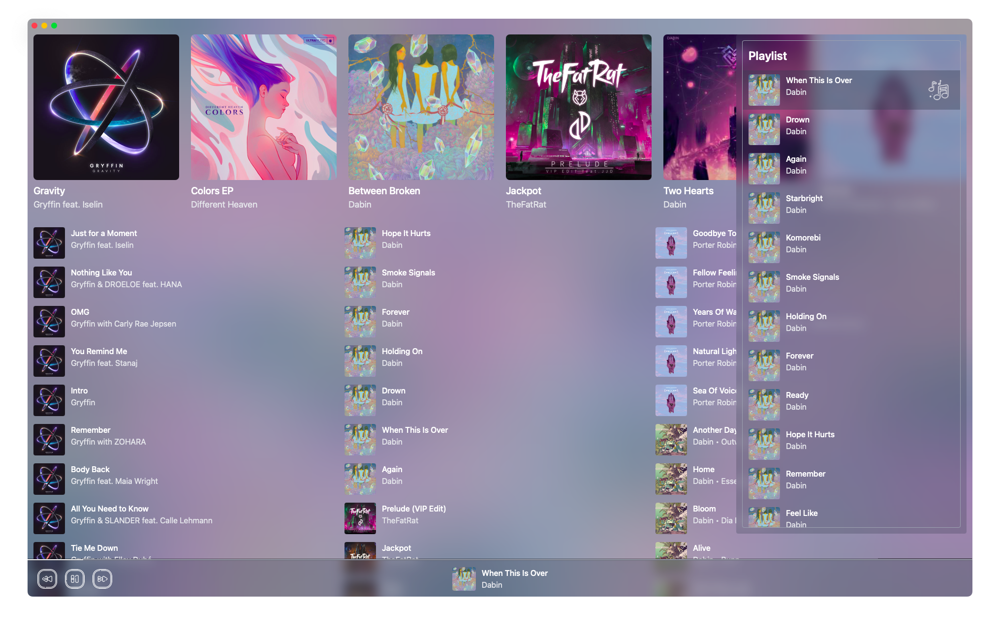

# Fluyer
Music Player with Beautiful UI, Lightweight Performance, and Cross-Platform.

## Installation
You can grab the alpha version on the Releases page or just [click this](https://github.com/alvindimas05/Fluyer/releases/tag/v0.0.1-alpha).

## Credits
- [Music Icons](https://www.flaticon.com/packs/music-249)
- [Default/Empty Album Cover](https://www.freepik.com/free-vector/music-notes-rainbow-colourful-with-vinyl-record-white-backgro_24459713.htm)
- [Title Bar Buttons](https://www.flaticon.com/authors/sonnycandra)