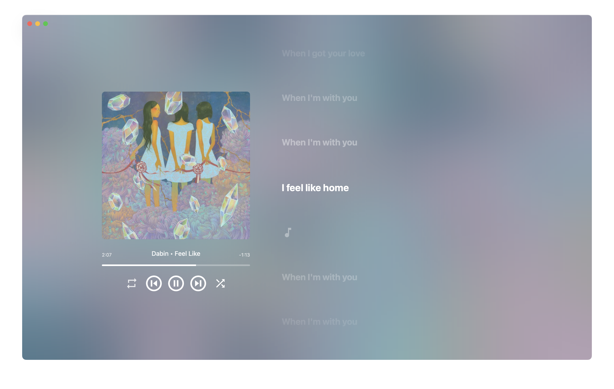

<p align="center">
  
</p>

<h1 align="center">🦋🎵 Fluyer</h1>
<p align="center">A Beautiful Cross-Platform Music Player</p>
<p align="center">
  <a href="https://discord.gg/UNZMGGPjpD">
    
  </a>
</p>
<p align="center">
  <a href="https://github.com/alvindimas05/Fluyer/stargazers">
    
  </a>
  <a href="https://github.com/alvindimas05/Fluyer/releases/latest">
    
  </a>
  <a href="https://github.com/alvindimas05/Fluyer/releases">
    
  </a>
</p>

> [!NOTE]
> This project is a slow-paced hobby. It is still in a beta version and under development. It may contain bugs or missing features. I’m building it just for fun :)

---

<p align="center">
  
  
</p>

---

## 📦 Installation

> [!NOTE]
> Supported Platforms: <b>Windows, macOS, Android, Ubuntu/Debian, Arch Linux.</b>

Download and install the latest version by clicking the button below.

### [Go to Latest Release](https://github.com/alvindimas05/Fluyer/releases/latest)

### Arch Linux

If you have `yay` installed, You can install from the AUR with the following command:

```bash
yay -S fluyer
```

If you don't have `yay` installed, you can install from the [Fluyer AUR Page](https://aur.archlinux.org/packages/fluyer/) and run the following command:

```bash
git clone https://aur.archlinux.org/fluyer.git
cd fluyer
makepkg -si
```

---

## 🐞 Known Issues

### macOS

> [!IMPORTANT]
> 🔐 The app is **not notarized** due to Apple Developer fees. macOS will warn that Fluyer “cannot be verified.” This is expected and harmless.

#### macOS 14 (Sonoma) and below:

1. Right-click `Fluyer.app`
2. Select **Open**
3. Confirm again in the dialog

#### macOS 15 (Sequoia) and above:

1. Open the app — it will be blocked
2. Go to `System Settings > Privacy & Security`
3. Scroll down and click **Open Anyway**
4. Confirm and authenticate
5. Open again from **Applications**

---

### iOS

> [!IMPORTANT]
> 🍏 **iOS version is not available.** Although previously tested, I don’t plan to release it due to Apple Developer fees.

---

## ❤️ Contributing

PRs and feedback are welcome, but again—this project is made for fun!

---

## 📝 Credits

- [Vissonance](https://github.com/tariqksoliman/Vissonance) by [tariqksoliman](https://github.com/tariqksoliman)

---

## 📄 License

This project includes code from the Vissonance project, which is licensed under the MIT License.  
See [licenses/Vissonance-LICENSE](licenses/Vissonance-LICENSE) for the full license text.

This project is licensed under the MIT Non-Commercial License.  
See [LICENSE](./LICENSE) for details.
